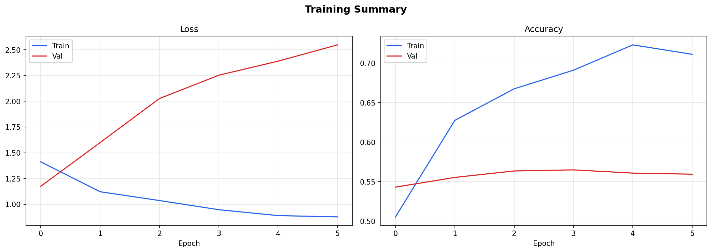
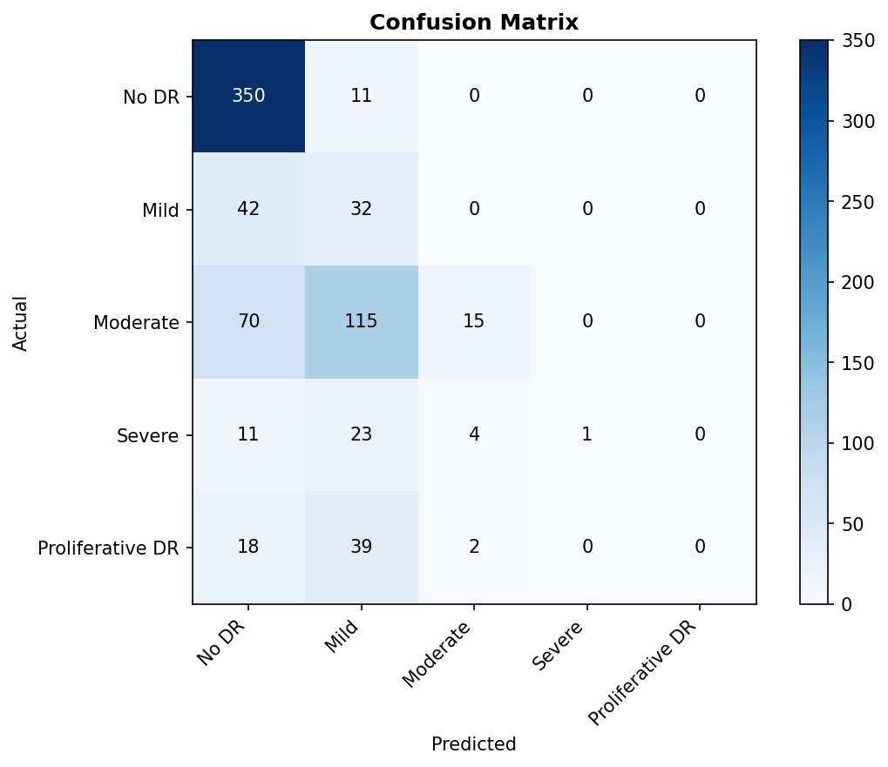
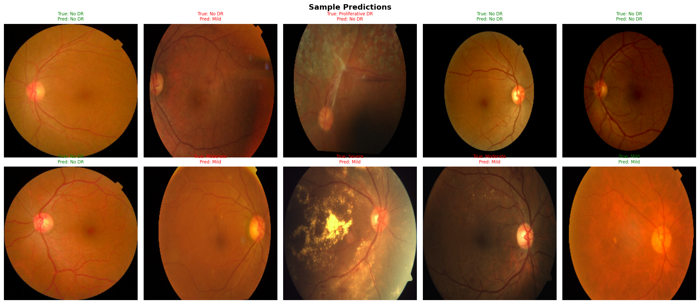

# Diabetic Retinopathy Detection
### CNN-based Classification using EfficientNetB3 + TensorFlow/Keras

---

## Overview

Diabetic retinopathy is a complication of diabetes that damages blood vessels in the retina and can lead to vision loss. This project uses deep learning to automatically detect and classify the severity of diabetic retinopathy from fundus eye photographs.

The model classifies retinal images into 5 severity grades:

| Grade | Label |
|-------|-------|
| 0 | No DR |
| 1 | Mild |
| 2 | Moderate |
| 3 | Severe |
| 4 | Proliferative DR |

---

## Dataset

**Diabetic Retinopathy 224×224 (2019 Data)**  
Source: [Kaggle](https://www.kaggle.com/datasets/sovitrath/diabetic-retinopathy-224x224-2019-data)

- 3,662 fundus images across 5 classes
- Images pre-processed with Gaussian filtering
- Significant class imbalance (49.3% No DR)

---

## Model Architecture

- **Backbone:** EfficientNetB3 (pretrained on ImageNet)
- **Fine-tuning:** Last 30 layers unfrozen
- **Head:** GlobalAveragePooling → Dropout(0.4) → Dense(512, ReLU) → Dropout(0.3) → Dense(5, Softmax)
- **Framework:** TensorFlow / Keras

---

## Training Details

| Parameter | Value |
|-----------|-------|
| Image Size | 224 × 224 |
| Batch Size | 64 |
| Epochs | 20 |
| Optimizer | Adam (lr=1e-4) |
| Loss | Categorical Crossentropy |
| Class Weights | Inverse frequency balancing |
| Callbacks | ModelCheckpoint, EarlyStopping, ReduceLROnPlateau |

### Data Augmentation
- Random horizontal & vertical flips
- Random rotation (±20°)
- Brightness jitter
- Zoom

---

## Results

| Metric | Value |
|--------|-------|
| Quadratic Weighted Kappa | 0.4061 |
| Validation Accuracy | ~55% |

### Training Curves


### Confusion Matrix


### Sample Predictions


---

## Project Structure

```
diabetic-retinopathy-detection/
├── notebook.ipynb           # Full training notebook
├── submission.csv           # Model predictions
├── training_curves.png      # Loss & accuracy plots
├── confusion_matrix.png     # Confusion matrix
├── sample_predictions.png   # Sample eye image predictions
└── README.md
```

---

## How to Run

1. Open the notebook on **Kaggle**
2. Add the dataset: `sovitrath/diabetic-retinopathy-224x224-2019-data`
3. Enable **GPU T4** accelerator
4. Run all cells

---

## Tech Stack

- Python 3.10
- TensorFlow 2.x / Keras
- EfficientNetB3
- scikit-learn
- OpenCV
- Matplotlib / Pandas / NumPy

---

## References

- [APTOS 2019 Blindness Detection](https://www.kaggle.com/c/aptos2019-blindness-detection)
- [EfficientNet Paper](https://arxiv.org/abs/1905.11946)
- Problem Statement PS-5 — Larsen & Toubro Limited (2023)
